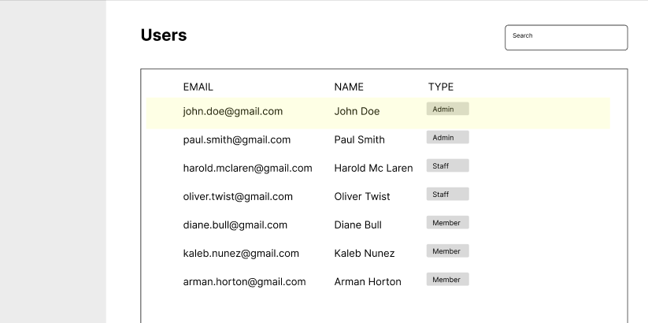

## Getting Started

- Fork and clone this repo
- Do the test and commit as you are used to do
- Send us the fork url so we can take a look !


```bash
npm run dev
```

Open [http://localhost:3000](http://localhost:3000) with your browser to see the result.

This is an example of the expected integration, but feel free to let your imagination speaks



## Requirements 

- TypeScript and Tailwind must be used
- The project is expected to have some UI/UX integration and best practices applied
- You shouldn't need to add any library (except if you have a very good reason to do so)
- Mock must not be changed

The following features are expected to be in the technical assessment : 

- Create an API endpoint /search to get the list of users (mock provided)
- Display users
- Add a searchbar to filter users
- Update user name (without using api)
- Add pagination (10 users per page)
- Add alphabetical sort 
- Loading state


## If you want to go beyond

You can add any extra feature that you'd like but that's not required. 

